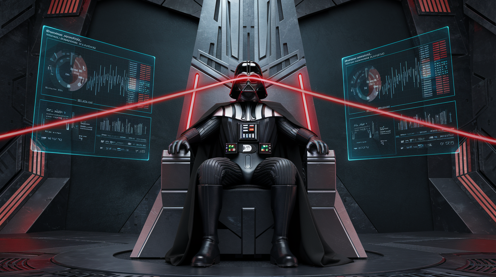
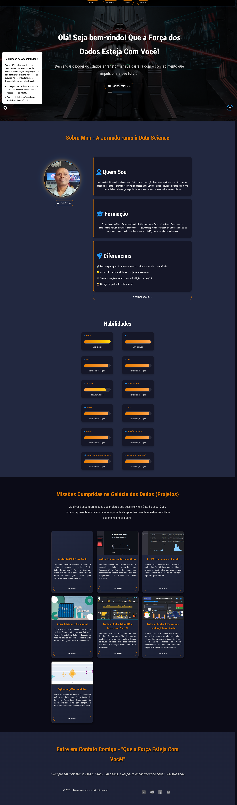

# ✨ Portfólio Web - Eric Pimentel | Data Science Padawan

## 🚀 Que a Força dos Dados Esteja Com Você!

Bem-vindo ao meu portfólio web, um espaço dedicado a apresentar minha jornada como **Padawan em Data Science** e minhas habilidades na **Galáxia dos Dados!** 🌌

Este site foi cuidadosamente construído para demonstrar minhas competências em **análise de dados, visualização e desenvolvimento web frontend**, utilizando tecnologias modernas e um design cativante inspirado no universo de Star Wars.

## 🎯 Propósito do Projeto

O objetivo principal deste portfólio é:

*   **Vitrine Profissional:** Apresentar de forma clara e impactante meus projetos de Data Science para recrutadores, empresas e a comunidade tecnológica.
*   **Demonstração de Habilidades:**  Exibir minhas habilidades técnicas em Data Science (Python, SQL, Power BI, etc.) e frontend (HTML, CSS, JavaScript, Responsividade).
*   **Compartilhamento de Jornada:**  Documentar minha evolução e paixão pela área de dados, desde a Engenharia Elétrica até a Ciência de Dados.
*   **Networking:** Facilitar o contato e o networking com profissionais e empresas da área.

## 🛠️ Tecnologias e Poderes Jedi Utilizados

Este portfólio foi construído utilizando as seguintes tecnologias e "Poderes Jedi":

*   **Frontend:**
    *   **HTML5:** Estrutura semântica e organização do conteúdo.
    *   **CSS3:** Estilização visual, design responsivo e tema inspirado em Star Wars.
    *   **JavaScript:** Interatividade do menu hambúrguer e funcionalidades futuras.
    *   **Font Awesome:** Biblioteca de ícones para enriquecer a interface visual.
    *   **Responsividade (Mobile-First):**  Site totalmente adaptado para diferentes dispositivos (desktop, tablet, mobile) com **Media Queries e Menu Hambúrguer**.

*   **Design e UX/UI:**
    *   **Design Temático:**  Identidade visual inspirada no universo de Star Wars, com paleta de cores escura e elementos visuais característicos.
    *   **Foco na Experiência do Usuário (UX):** Navegação intuitiva, layout limpo e escaneável, informações claras e objetivas.
    *   **Design Responsivo (UI):**  Adaptação da interface para diferentes tamanhos de tela, garantindo a melhor experiência em qualquer dispositivo.

## ⚙️ Processo de Planejamento e Construção

A construção deste portfólio foi uma jornada Jedi em si, seguindo as seguintes etapas:

1.  **Concepção e Design:**
    *   Definição do **tema visual** (Star Wars) e da **paleta de cores**.
    *   **Wireframing e Mockup:**  Esboço da estrutura do site e layout das seções (Header, Sobre Mim, Habilidades, Projetos, Contato, Footer).
    *   **Design Mobile-First:**  Priorização da experiência mobile desde o início do design.

2.  **Desenvolvimento Frontend:**
    *   **HTML Estruturado:** Criação da estrutura HTML semântica, dividindo o site em seções lógicas e organizadas.
    *   **CSS Estilizado:** Desenvolvimento do CSS para aplicar o design temático, cores, tipografia e responsividade. Uso de `media-queries.css` para estilos mobile e `style.css` para estilos gerais e desktop.
    *   **Menu Hambúrguer Responsivo:** Implementação do menu hambúrguer com HTML, CSS e JavaScript para otimizar a navegação em mobile.
    *   **Integração de Font Awesome:** Adição de ícones para enriquecer visualmente a seção de habilidades e contato.

3.  **Conteúdo e Projetos:**
    *   **Redação dos Textos:** Criação de textos persuasivos e autênticos para a seção "Sobre Mim", destacando a paixão por Data Science e a jornada profissional.
    *   **Seleção e Descrição dos Projetos:** Escolha dos projetos de Data Science mais relevantes para o portfólio e elaboração de descrições concisas e informativas para os cards.
    *   **Imagens e Miniaturas:**  Utilização de imagens de alta qualidade para o header e miniaturas dos projetos, com padronização de tamanhos para os cards.

4.  **Responsividade e Testes:**
    *   **Testes em Diversos Dispositivos:**  Testes rigorosos em diferentes navegadores e dispositivos (desktop, tablet, mobile) para garantir a responsividade e o correto funcionamento do site.
    *   **Ajustes e Refinamentos:**  Iterações e ajustes no código CSS e HTML para otimizar o layout e a experiência do usuário em todas as telas.

## ⚔️ Desafios e Soluções Encontradas na Galáxia do Código

A jornada de construção responsiva deste portfólio foi **repleta de desafios**, típicos do desenvolvimento web moderno. Enfrentamos **batalhas épicas com a responsividade**, mas com a **Força do conhecimento e da persistência**, **SAÍMOS VITORIOSOS!** 💪

Os principais desafios e soluções foram:

*   **Responsividade do Menu:**  O menu horizontal inicial, elegante para desktop, **tornou-se um verdadeiro Lord Sith em telas mobile!** Oportunidade excessivo e prejudicando a navegação. **Solução:** A **IMPLEMENTAÇÃO DO MENU HAMBÚRGUER**, com sua simplicidade e eficácia, **RESTAUROU O EQUILÍBRIO NA FORÇA!**  Utilizamos HTML, CSS e JavaScript para criar um menu hambúrguer **totalmente funcional e adaptado para mobile**, garantindo uma navegação **INTUITIVA E OTIMIZADA** em qualquer dispositivo.

*   **Design Temático Consistente:**  Manter a consistência visual do tema Star Wars em todas as seções e dispositivos, **sem cair no "lado sombrio" da poluição visual**, foi um desafio constante. **Solução:**  A **UTILIZAÇÃO DE UMA PALETA DE CORES COESA**, tipografia adequada e elementos visuais sutis inspirados na saga, **GUIARAM-NOS PARA A LUZ!**  Garantimos um **design temático elegante e profissional**, evocando o universo Star Wars de forma **SUTIL E IMPACTANTE.**

*   **Otimização do Layout dos Projetos:**  Garantir que os cards de projetos fossem visualmente atraentes e bem distribuídos em diferentes tamanhos de tela, **SEM CAUSAR UM "IMPERIO DE CARDS" DESORGANIZADO**, exigiu **ESTRATÉGIA E PRECISÃO.** **Solução:**  A **UTILIZAÇÃO DE CSS GRID**, com sua **PODEROSA FLEXIBILIDADE**, foi a chave!  Criamos um layout responsivo e adaptável para os cards, ajustando o tamanho e o espaçamento para diferentes dispositivos, **MANTENDO A HARMONIA VISUAL E A ORGANIZAÇÃO IMPECÁVEL.**

## 🖼️ Visão Geral do Portfólio - Telas Full-Screen

Para apreciar a **beleza e o profissionalismo** deste portfólio em sua totalidade, confira as capturas de tela **Full-Screen** em diferentes dispositivos:

  
Role para ver mais →

  

    
  

## 🎯 Atualizações da Nova Versão

Nesta nova versão do meu portfólio, foram implementadas diversas melhorias e recursos:

* **Visual Aprimorado**: O site foi remodelado para refletir mais fielmente o universo de Star Wars, com um design temático que encanta os visitantes.
* **Efeitos de Áudio**: Agora, ao carregar a página, efeitos de áudio imersivos são reproduzidos, proporcionando uma experiência única e envolvente.
* **Menu Melhorado**: O menu de navegação foi aprimorado, agora fixo no topo da página para facilitar o acesso às seções.
* **Menu Mobile Remodelado**: O menu mobile foi redesenhado, e o botão hamburger está funcionando perfeitamente, garantindo uma navegação intuitiva em dispositivos móveis.
* **Novo Botão "Gere Meu CV"**: Implementação de um botão de download do currículo com melhorias de responsividade para telas mobile
* **Integração com Google Analytics**: Configuração completa de tracking para coletar dados de:
  - Navegação e cliques
  - Downloads de arquivos
  - Tempo de permanência na página
  - Profundidade de rolagem
* **Análise de Dados**: Os dados coletados serão utilizados para:
  - Estudos analíticos sobre comportamento do usuário
  - Criação de dashboards no Looker Studio
  - Melhoria contínua da experiência do usuário
* **Botão de Acessibilidade**: Implementação de um novo botão de acessibilidade informando aos usuários que o site está adequado aos padrões de acessibilidade, garantindo assim uma melhor inclusão digital.

### Desafios Enfrentados

Implementar os novos recursos de áudio trouxe desafios interessantes, especialmente na integração com o JavaScript para criar efeitos sonoros que melhoram a experiência do usuário. A implementação desses recursos exigiu atenção especial para garantir que o desempenho do site não fosse comprometido.

## 🤖 Construído com a Força da IA Generativa!

É importante ressaltar que a **CONSTRUÇÃO DESTE PORTFÓLIO FOI GRANDEMENTE AUXILIADA PELO PODER DA INTELIGÊNCIA ARTIFICIAL GENERATIVA!** 🚀

Ferramentas de **IA Generativa** foram **FUNDAMENTAIS EM DIVERSAS ETAPAS DO PROCESSO**, desde a **GERAÇÃO DE IDEIAS DE DESIGN E LAYOUT**, passando pela **OTIMIZAÇÃO DO CÓDIGO FRONTEND (HTML, CSS, JavaScript)**, até a **CRIAÇÃO DE TEXTOS PERSUASIVOS E OTIMIZADOS PARA SEO!**

**A IA Generativa AGIU COMO UM VERDADEIRO "PADAWAN AUXILIAR"**, acelerando o desenvolvimento, sugerindo soluções criativas e permitindo que eu **FOQUE EM APRIMORAR A EXPERIÊNCIA DO USUÁRIO E A QUALIDEA GERAL DO PORTFÓLIO!**

**ESTE PROJETO É UM TESTEMUNHO DO PODER DA COLABORAÇÃO HUMANO-IA NO DESENVOLVIMENTO WEB MODERNO!** 🤝🤖

## 🔭 Próximos Níveis na Jornada Jedi (Melhorias Futuras)

Embora o portfólio esteja pronto para brilhar na galáxia, a jornada de um Padawan nunca termina! Algumas melhorias futuras que pretendo implementar incluem:

*   **Internacionalização (i18n):** Adicionar suporte a outros idiomas (inglês, espanhol) para alcançar um público global e tornar o portfólio mais acessível.
*   **Blog Integrado:** Criar a blog para compartilhar artigos e *insights* sobre Data Science, demonstrando meu aprendizado contínuo e expertise na área.
*   **Animações e Interações:**  Adicionar animações sutis e interações para tornar a experiência do usuário ainda mais envolvente e dinâmica, melhorando a interação com o portfólio.
*   **Otimização de Performance:**  Implementar técnicas de otimização de performance (compressão de imagens, *lazy loading*, etc.) para garantir um carregamento rápido e eficiente do site, proporcionando uma melhor experiência ao usuário.
* **Acessibilidade (A11y):** Aprimorar a acessibilidade do site, seguindo as WCAG para garantir que seja utilizável por todos os usuários, incluindo pessoas com deficiência, promovendo inclusão digital.
* **Testes de Acessibilidade com Orca:** Implementação de testes de acessibilidade utilizando o Orca, um leitor de tela de código aberto. Isso permite verificar a navegação e a leitura de elementos por usuários com deficiência visual, garantindo que o site seja acessível e funcional para todos.

## 🌌 Acessibilidade e Inclusão Digital

A acessibilidade é uma prioridade neste projeto. Para garantir que o site seja utilizável por todos, incluindo pessoas com deficiência visual, implementei testes de acessibilidade utilizando o Orca, um leitor de tela de código aberto. Esses testes permitem verificar a navegação e a leitura de elementos, assegurando que o site seja acessível e funcional para todos os usuários.

### Como Testar a Acessibilidade com Orca:

**Para usuários Linux:**
1. Inicie o Orca no terminal com o comando: `orca &`
2. Navegue pelo site usando o teclado. O Orca lerá em voz alta os elementos da interface.
3. Verifique se todos os elementos interativos são anunciados corretamente e se as informações são claras.
4. Para parar o Orca, pressione `Insert + Q` ou encerre o processo no terminal.

**Para usuários Windows:**
1. Instale o NVDA (NonVisual Desktop Access), um leitor de tela gratuito e de código aberto, disponível em: https://www.nvaccess.org/
2. Após a instalação, inicie o NVDA.
3. Navegue pelo site usando o teclado. O NVDA lerá em voz alta os elementos da interface.
4. Verifique se todos os elementos interativos são anunciados corretamente e se as informações são claras.
5. Para parar o NVDA, pressione `Insert + Q`.

Essa funcionalidade foi implementada para promover a inclusão digital e garantir que o site esteja alinhado com as melhores práticas de acessibilidade.

Este portfólio representa um passo importante na minha jornada em Data Science. Agradeço a você por explorar minhas "Missões Cumpridas na Galáxia dos Dados"!

**"Do tamanho da sua fé, será o seu caminho." - Mestre Yoda 🚀 ✨**

## 👨‍💻 Contato e Conexões

**Desenvolvido com paixão e a Força dos Dados por:**

**Eric Pimentel**

---

*✨ Última atualização: Fevereiro de 2025 ✨*
